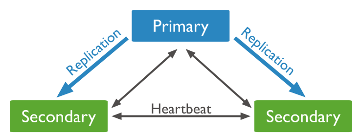

# MongoDB-replica-Setup

## Concepto

Un conjunto de réplicas en MongoDB es un grupo de procesos mongod que proporcionan redundancia y alta disponibilidad. Los miembros de un conjunto de réplicas son:

* Primario.
El primario recibe todas las operaciones de escritura.

* Secundarios.
Los secundarios replican las operaciones del primario para mantener un conjunto de datos idéntico. Los secundarios pueden tener configuraciones adicionales para perfiles de uso especiales. Por ejemplo, las secundarias pueden ser sin derecho a voto o con prioridad 0.
La configuración mínima recomendada para un conjunto de réplicas es un conjunto de réplicas de tres miembros con tres miembros portadores de datos: uno principal y dos secundarios. En algunas circunstancias (como si tiene una primaria y una secundaria, pero las restricciones de costo prohíben agregar otra secundaria), puede optar por incluir un árbitro. Un árbitro participa en las elecciones pero no tiene datos (es decir, no proporciona redundancia de datos).

## Preocupación de escritura para conjuntos de réplicas

La preocupación de escritura por conjuntos de réplicas describe el número de miembros portadores de datos (es decir, el primario y los secundarios, pero no los árbitros) que deben reconocer una operación de escritura antes de que la operación devuelva como exitosa. Un miembro solo puede reconocer una operación de escritura después de haber recibido y aplicado la escritura correctamente.

### Diagrama de replicacion



### Comportamiento de reconocimiento


## Levantamiento de los servicios de replicacion con MongoDB

### Pre-requisitos

Como pre-requisitos para poder realizar el levantamiento, se necesita tener instalado `Docker` y `Docker-compose`, el sistema operativo, es Linux
Ubuntu 16.X.X, y el conocimiento basico de NoSql

### Levantamiento

* Iniciamos el levantamiento con la construccion de los contenedores en listados en el [Docker-compose.yml](docker-compose.yml), con el comando:

```sh
    sudo docker-compose up
```

* Inicializara el log de servicios ejecutandose en cada contenedor levantado, evitamos ocultarlo para ver como se comporta a traves de la pruebas, como por siguiente
vamos a iniciar/entrar a los contendores, en 3 terminales diferentes.

* Terminal 1: `sudo docker exec -it localmongo1 /bin/bash`
* Terminal 2: `sudo docker exec -it localmongo2 /bin/bash`
* Terminal 3: `sudo docker exec -it localmongo3 /bin/bash`

### Terminal #1

Ejecutamos en la terminal `mongo`, para entrar al servicio de MongoDB

* Agregamos la configuracion inicial para el Set replicate e ir agregando los otros contenedores al grupo, con el siguiente metodo:

```sh
rs.initiate(
   {
     _id : 'rs0',
     members: [
       { _id : 0, host : "mongo1:27017" },
       { _id : 1, host : "mongo2:27017" },
       { _id : 2, host : "mongo3:27017" }
     ]
   }
 )
```

### Verificar operaciones de escritura en conjuntos de réplicas

* Creamos nuestra base de datos, que tomare como ejemplo el nombre de `utp` y hacemos de selecion el cambio a la DB.

```mongo
use utp
```

* Verificamos de que se haya creado con el siguiente comando `show dbs` y debe salir nuestra base de datos en la lista.

* Realizamos un Query de Insert en nuestra base de datos ya creada anteriormente

```sh
db.products.insert(
   { item: "envelopes", qty : 100, type: "Clasp" },
   { writeConcern: { w: "majority" , wtimeout: 5000 } }
)
```

---

#### Sobre WriteConcern

La operación especifica el `majority` problema de escritura y un tiempo de espera de 5 segundos utilizando el `wtimeout` parámetro de problema de escritura para que la operación no se bloquee indefinidamente.

La aplicación espera hasta que los retornos primarios escriban un reconocimiento de preocupación, lo que indica que una mayoría calculada de los miembros votantes que portan datos reconocieron la operación de escritura.

---

* Verificamos de que se haya insertado los datos en nuestro `Schema` correctamente, con el comando (Terminal #1):

```sh
db.products.find().pretty()
```

> Debe salir algo como esto

```json
{
  "_id" : ObjectId("6088a7eaf7e4f0f0f4f5fb95"), //El ObjectID value es dinamico
  "item" : "envelopes",
  "qty" : 100,
  "type" : "Clasp"
}
```

## Terminal #2

Debe salir con una etiqueta `Secondary`, esto nos indica que prioridad tiene el servicio en el conjunto de replicacion.

Verificamos de que los datos se hayan replicados correctamente, pero primero debemos indicarle al servicio secundario leer los datos, con el comando:

```sh
rs.secondaryOk()
```

Luego selecionamos la base de datos que deseamos leer y realizamos un Query de busqueda.

```sh
use utp
db.products.find().pretty()
```

Vericamos que se hayan replicado los datos.

> Si llegaste hasta aca sin ningun problemas, significa que estamos GOLDEN.

## Pruebas

Esta prueba tiene como objetivo comprobar la replicacion de datos e intercambiar de prioridad entre miembros de datos,
consiste en apagar el servicio principal, verificando de que un miembro del grupo queda asignado como primario e insertar datos desde el nuevo servicio primario,
al tener nuevos datos insertados, volveremos a correr el servicio apagado anteriormente y comprobar de que se haya hecho la replica de datos segun los registros de datos que se hicieron en los otros miembros.

* Apagamos el servicio con la etiqueta Primary, en mi caso es la terminal #1, con el comando:

```sh
sudo docker-compose stop mongo1
```

* Verificamos en la consola de registro de docker-compose que se ha detenido el container `mongo1`

* En la terminal #2, se ha cambiado la etiqueta a `PRIMARY`, vamos a insertar nuevos datos

```sh
db.products.insert({name: "Ada Lovelace", age: 205})
```

* En la terminal #3 con el servicio de `mongo3` y etiqueta `SECONDARY`, vamos usar el comando para verificar la replicacion de los datos nuevos

```sh
rs.secondaryOk()
```

Luego selecionamos la base de datos que deseamos leer y realizamos un Query de busqueda.

```sh
use utp
db.products.find().pretty()
```

> Si presenta los nuevos datos, como por ejemplo

```json
{
  "_id" : ObjectId("6088a7eaf7e4f0f0f4f5fb95"),
  "item" : "envelopes",
  "qty" : 100,
  "type" : "Clasp"
}
{
  "_id" : ObjectId("6088b1931b1d73bc745a69b1"),
  "name" : "Ada Lovelace",
  "age" : 205
}
```

* Iniciamos nuevamente el servicio de `mongo1`, en nuestra Terminal #1

```sh
sudo docker-compose start mongo1
```

* Entramos al servicio con el comando `sudo docker exec -it localmongo1 /bin/bash` y ejecutamos `mongo`, veremos que nuestra etiqueta sera `SECONDARY`, ejecutamos el comando para lectura de datos y selecionamos la base de datos.

```sh
rs.secondaryOk()
use utp
```

* Listamos los datos que hay en nuestro Schema `Products`, con el comando siguiente.

```sh
db.products.find().pretty()
```

> Si llega a mostrar los nuevos datos insertados, significa que se realizo la replicacion de datos actualizando los registros de sus grupo de miembros

# Gracias :3
